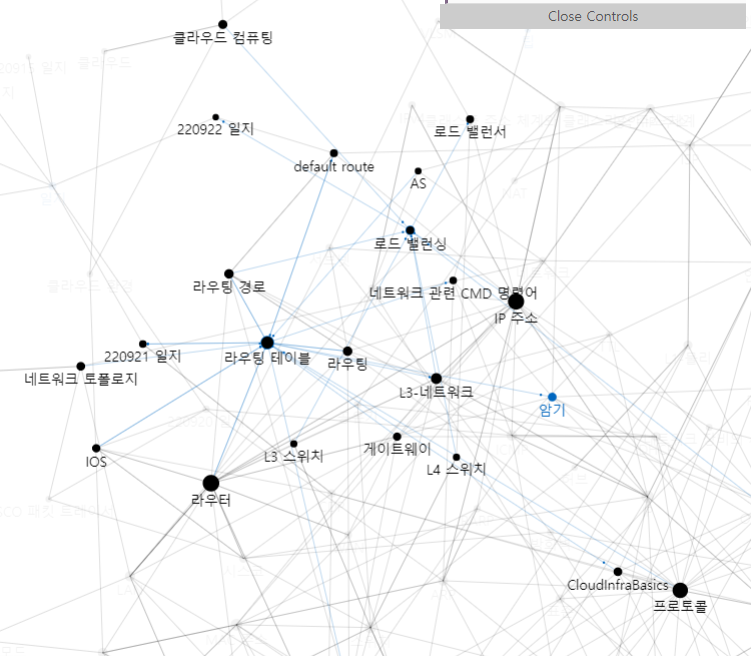
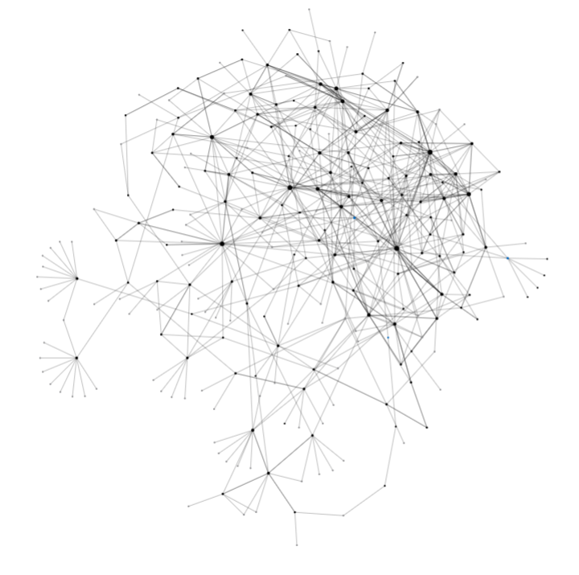
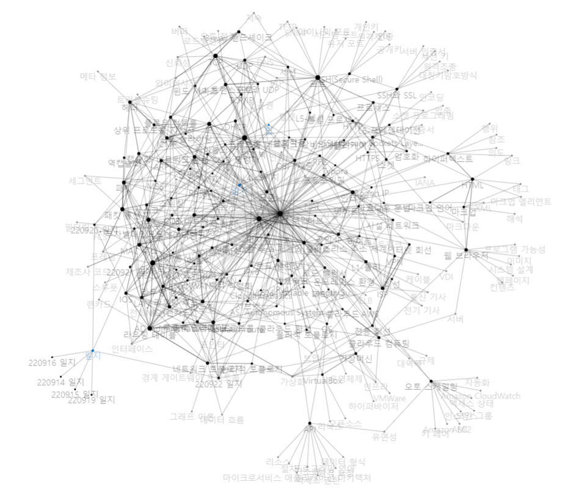

# 220922 일지

#일지

정적 라우팅 상황에서 [[로드 밸런싱]]과 [[default route]] 설정을 실습했다. (원노트 참고)

[[동적 라우팅 프로토콜]]을 배움. 

내일은 3시 30분에 시험을 본다. 
4지 선다 20 문제.

[[루프백 인터페이스]] 구성 실습을 함.

[[동적 라우팅 프로토콜]] 구성을 실습함. 

[[라우팅 루프]] 해결법을 좀 배움.

[[가상머신]]용 프로그램을 설치하기로 함.

전체문서색인을 추가했다. [[전체 문서 색인]]

[//begin]: # "Autogenerated link references for markdown compatibility"
[로드 밸런싱]: <../docs/로드 밸런싱.md> "로드 밸런싱"
[default route]: <../docs/default route.md> "default route"
[동적 라우팅 프로토콜]: <../docs/동적 라우팅 프로토콜.md> "동적 라우팅 프로토콜"
[루프백 인터페이스]: <../docs/루프백 인터페이스.md> "루프백 인터페이스"
[동적 라우팅 프로토콜]: <../docs/동적 라우팅 프로토콜.md> "동적 라우팅 프로토콜"
[라우팅 루프]: <../docs/라우팅 루프.md> "라우팅 루프"
[가상머신]: ../docs/가상머신.md "가상머신"
[전체 문서 색인]: <../docs/전체 문서 색인.md> "전체 문서 색인"
[//end]: # "Autogenerated link references"
[//begin]: # "Autogenerated link references for markdown compatibility"
[로드 밸런싱]: <../docs/로드 밸런싱.md> "로드 밸런싱"
[default route]: <../docs/default route.md> "default route"
[동적 라우팅 프로토콜]: <../docs/동적 라우팅 프로토콜.md> "동적 라우팅 프로토콜"
[루프백 인터페이스]: <../docs/루프백 인터페이스.md> "루프백 인터페이스"
[동적 라우팅 프로토콜]: <../docs/동적 라우팅 프로토콜.md> "동적 라우팅 프로토콜"
[라우팅 루프]: <../docs/라우팅 루프.md> "라우팅 루프"
[가상머신]: ../docs/가상머신.md "가상머신"
[전체 문서 색인]: <../docs/전체 문서 색인.md> "전체 문서 색인"
[//end]: # "Autogenerated link references"