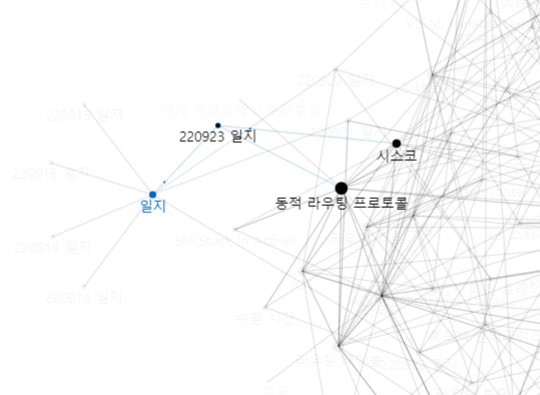
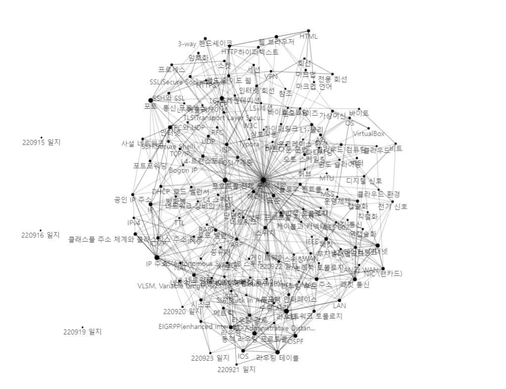

# 220923 일지

#일지

[[동적 라우팅 프로토콜]] 이어서 진행.
[[시스코]] 장비의 [[EIGRP]]를 많이 다룸. 
특히 3개 테이블과 DUAL 등.
네트워크 엔지니어가 될 것이 아니면 그다지 쓸모는 없어보임. 

[[OSPF]]도 실습함. 
[[NAT]] 등 라우터 기능을 좀 공부함.

[//begin]: # "Autogenerated link references for markdown compatibility"
[동적 라우팅 프로토콜]: <../docs/동적 라우팅 프로토콜.md> "동적 라우팅 프로토콜"
[시스코]: ../docs/시스코.md "시스코"
[EIGRP]: ../docs/EIGRP.md "EIGRPP(enhanced internet gateway routing protocol)"
[OSPF]: ../docs/OSPF.md "OSPF"
[NAT]: ../docs/NAT.md "NAT"
[//end]: # "Autogenerated link references"