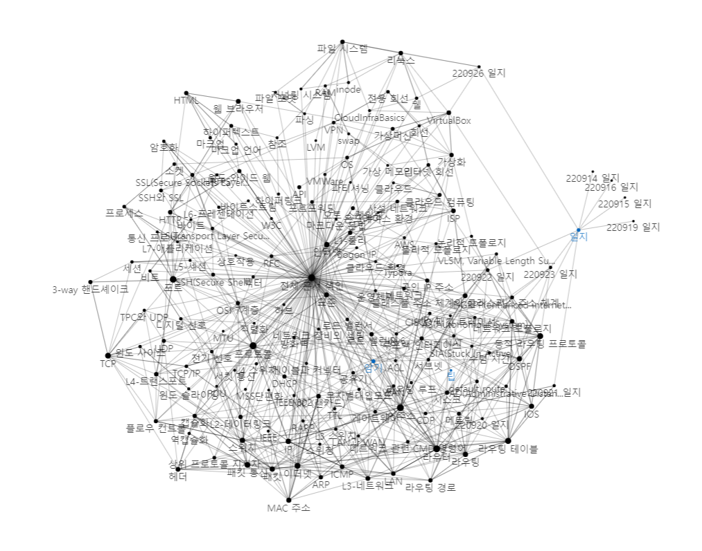
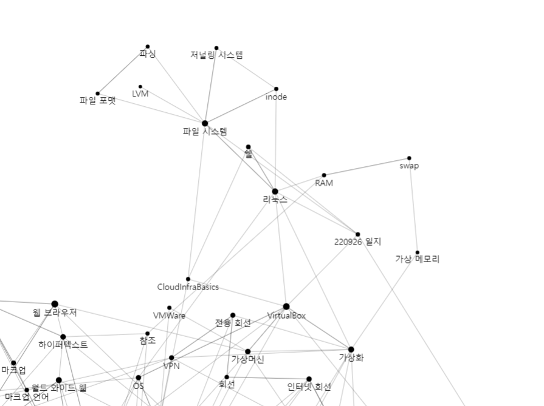

# 220926 일지

#일지

[[리눅스]]와 [[파일 시스템]]에 관해 많이 배웠다. 아주 알짜. 
[[Virtual Box]]에 리눅스를 설치했다. 

[[쉘]] 명령어를 좀 배웠다. 

[CCCR - 기업멤버십SW캠프 MLOps 플랫폼 전문인력 부트캠프 과정 만족도 조사](https://url.kr/ircwyp)

[//begin]: # "Autogenerated link references for markdown compatibility"
[리눅스]: ../docs/리눅스.md "리눅스"
[파일 시스템]: <../docs/파일 시스템.md> "파일 시스템"
[Virtual Box]: <../docs/Virtual Box.md> "VirtualBox"
[쉘]: ../docs/쉘.md "쉘"
[//end]: # "Autogenerated link references"