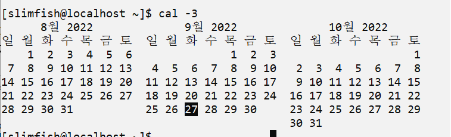
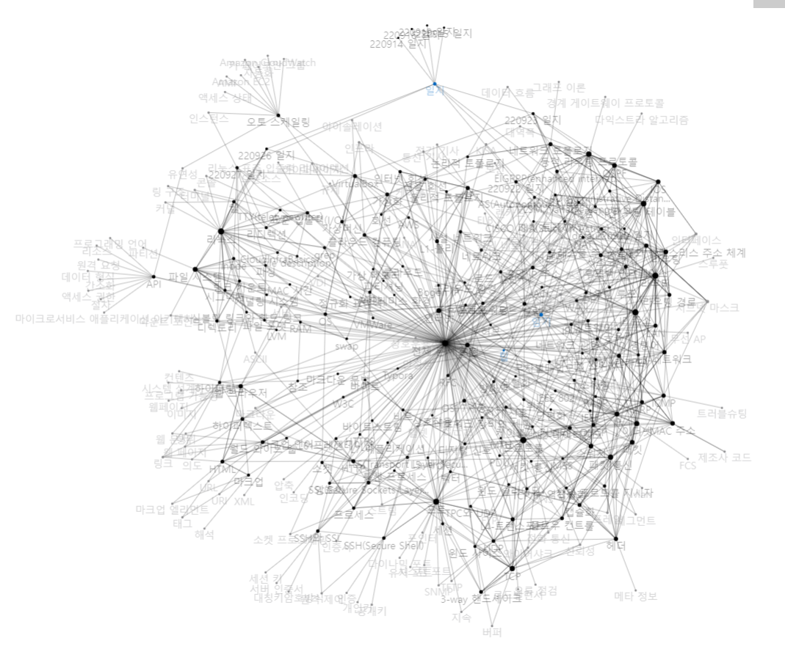
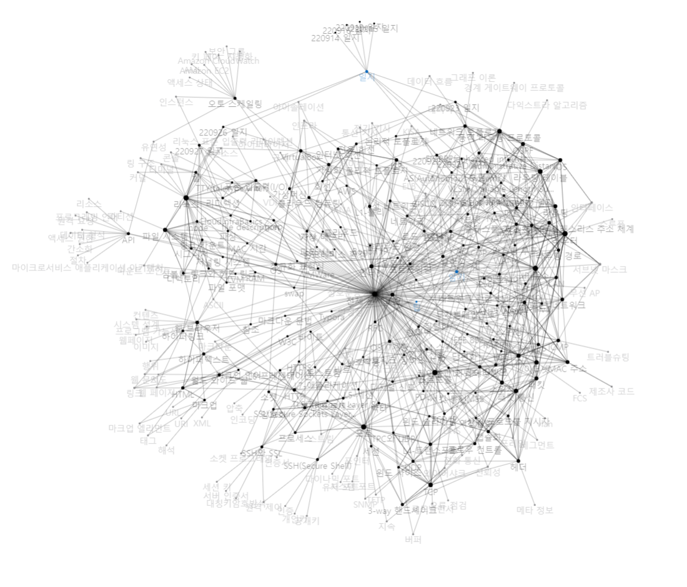

# 220927 일지

#일지

오늘도 [[리눅스]].

파일시스템의 [[inode]] 구조를 복습함. [[링크 카운트]]를 통해.

또 [[파싱]]을 통한 대규모 [[인스턴스]] 관리에 관한 이야기를 들음. 

[[리디렉션]]과 [[표준 입출력]]에 관한 여러 가지 노하우도 들음.

[[grep]], cat, more, head, tail은 필수 명령어다.

"""
명령어를 조합하고 정규식을 넣고 파싱하는 방식으로 리눅스를 멋지게 사용할 수 있다. 쉘스크립트와 정규식.   

클라우드 환경에서 시스템을 제어할 때도 마찬가지의 데이터 파싱을 할 수 있다! - 빅데이터의 모니터링과 효과적인 마이그레이션과 대시보드 제작, 관제 기술로 이어진다  

NHN이 인스턴스 수가 4000대일 때 관리자가 40명에 가까워질 때, 카카오 드라이브는 인스턴스가 10000대가 넘어가도 엔지니어가 2명이었다.  

카카오 드라이브 급의 관리가 되려면 오토메이션이 되어야 하고, 그러려면 정보가 필요하고, 정보가 필요하면 파싱이 되어야 하며, 파싱이 되려면 리눅스의 코어 체급이 좋아야 한다.  << 익혀둬야 하는 테크 습속  

리눅스는 가치가 있다. 

클라우드 분야는 인터넷과 연관된 형태로 작업도구와 협업도구를 사용하는 방향이 더 특화되어 있다. 워크그룹과 그 내부의 서비스 등. 문서의 조회와 지시 트래킹.  
협업도구의 사용이 곧 그 생태계의 이해와 직결되곤 한다. 클라우드 업계에서 사용하는 포맷을 잘 익힐 것.  

최근엔 깃허브 등으로 인해 마크다운 포맷을 많이 쓴다. 특히 성장과정을 체크하기 위해 블로그를 사용하는 편. 마크다운은 깃허브, 주피터, VSCode, 노션, 슬랙 등에서 쓴다.
"""

[//begin]: # "Autogenerated link references for markdown compatibility"
[리눅스]: ../docs/리눅스.md "리눅스"
[inode]: ../docs/inode.md "inode"
[링크 카운트]: <../docs/링크 카운트.md> "링크 카운트"
[파싱]: ../docs/파싱.md "파싱"
[리디렉션]: ../docs/리디렉션.md "리디렉션"
[표준 입출력]: <../docs/표준 입출력.md> "표준 입출력(I/O)"
[grep]: ../docs/grep.md "grep"
[//end]: # "Autogenerated link references"